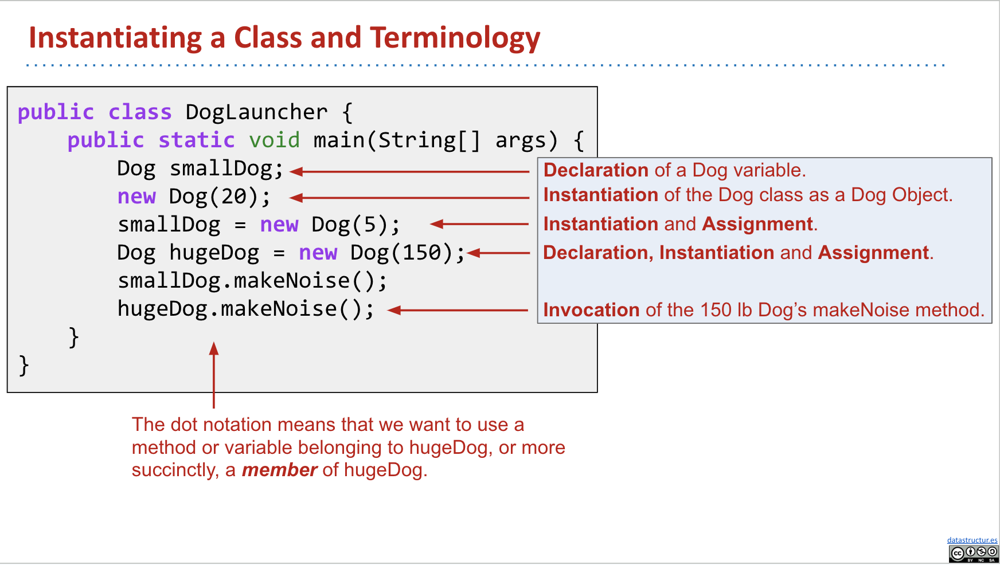

# CS61B Data Structures

# Introduction to Java

Few rules:  

1. In Java, all code lives inside of classes.
2. When you run a Java program, the code running is typically inside of a method called `main` and declared as:

```java
public static void main(String[] args)
```

3. Statements must end with semi-colon.


## Compilation
Running a Java Program:  

Step1: Java compiler `javac`  
Step2: Java interpreter `java` 


- Why make a class file at all?  
    - .class file has been type checked. Distributed code is safer.
    - .class file are similer for machine to execute. Distributed code is faster
    - Minor benefit: protects your intellectual property. No need to give out source.


## Static Typing
One of the most important features of Java is that all variables and expressions hava a `static type`.  
Java variables can contain values of that type and only that type.
Compiler performs a static type check and ensures that all types are compatible.


## Defining Functions in Java
More rules:  

1. Functions must be declared as part of a class in Java.
A function that is part of a class is called a method. In Java, all functions are methods.
2. To define a function in Java, we use `public static` (there are alternate ways of defining a function).
3. All parameters of a function must have a declared type, and the return value of a function must have a declared type.
4. Functions in Java only return one value.


# Defining and Using Classes

## Static vs. Non-Static Method

- Classes in Java can contain not just functions (aka methods), but also data
- Classes can be initiated as objects
    - From our Dog class example, we can create instances of this Dog. **Instance can also called objects.**
    - There will be instance variables representing property of dogs, such as weights, heights, ...
    - We will have a **consttructor** to determine how to instantiate the class.




## Class Methods vs. Instance Methods

Key difference between static(class) and non-static(instance) methods:  
1. Static methods are invoked using the class name, e.g. Dog.makeNoise();
2. Instance methods are invoked using an instance name, e.g. maya.makeNoise();
3. Static method can't access "my" instance variables, because there is no "me".

Why Static method?  
Example: `Math ` class provides a `sqrt` method. Because it is static, we can call it as follows:

```java
x = Math.sqrt(100);
```

If `sqrt` is an non-static, instance method, we have to instead call the function with awkward syntax below:

```java
Math m = new Math();
x = m.sqrt(100);
```

Sometimes, it is reasonable to have a class with both instance and static methods. For example:

```java
public static Dog maxDog(Dog d1, Dog d2) {
    if (d1.weightInPounds > d2.weightInPounds) {
        return d1;
    }
    return d2;
}
```
We have a static method here to compare Dogs. And this method is invoked by: 

```java
Dog d = new Dog(15);
Dog d2 = new Dog(100);
Dog.maxDog(d, d2);
```

## Static Variables

There are properties inherent to the class itself, rather than the instance. This means that the value of static varaible is shared among all instances of the class, rather than each object having its own copy of the variable.

Static memebers are always accessed using class name, ex: Dog.binomen.

## public static void main(String[] args)

1. `static`: it is a static method, not associated with any particular instance
2. `void`: it has no return type
3. `main`: the name of the method
4. `String[] args`: a parameter that is passed to the main method

example on **Command Line Arguments**

```java
public class ArgsDemo {
    public static void main(String[] args) {
        System.out.println(args[0]);
    }
}
```

This program prints out the 0th command line argument. ex:

```terminal
$ java ArgsDemo these are command line arguments
these
```

In this case, `args` is an array of Strings: {"these", "are", "command", "line", "arguments"}.
